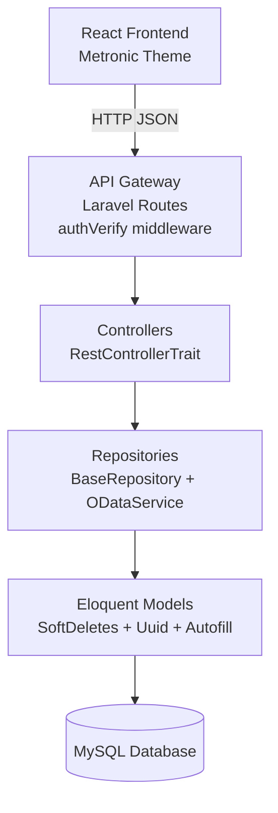

# Design Document — Sprint 1: Foundation

## Overview

Sprint 1 delivers five features that form the HMS foundation:

| Feature ID | Feature | Status |
|---|---|---|
| F-01-01 | Patient Registration & UHID Generation | New — backend skeleton exists, needs route + frontend |
| F-01-02 | Patient Search & Advanced Filter | New — flows from F-01-01 |
| F-13-01 | Employee Master | Backend exists, frontend missing |
| F-15-01 | Role-Based Access Control (RBAC) | Already implemented — verify & document only |
| F-15-03 | Master Data Management | Partially implemented — departments, designations, units exist; enums exist |

The implementation follows the project's established patterns:
- **Backend**: `php artisan imake:crud` skeleton → update migration/model/validator/resource/routes
- **Frontend**: Copy Example Module → rename → update fields/columns/API

---

## Architecture



All API calls go through `authVerify` middleware (JWT check) and `restrictIp` middleware. Controllers use `RestControllerTrait` for standard CRUD. Repositories extend `BaseRepository` with OData-powered filtering/sorting/pagination.

---

## Components and Interfaces

### Backend Components

#### F-01-01 / F-01-02 — Patient

| Layer | File | Action Required |
|---|---|---|
| Migration | `2026_06_22_103944_create_patients_table.php` | Fix duplicate column issues (updated_by / status defined twice, add missing city/state indexes) |
| Model | `app/Models/Patient.php` | Already complete |
| Repository | `app/Repositories/PatientRepository.php` | Add `department_id` filter; `fieldSearchable` covers `first_name`, `mrn` — extend to `primary_phone`, `last_name` |
| Validator | `app/Validators/PatientValidator.php` | Add `primary_phone` unique rule on POST; relax `blood_group` required |
| Resource | `app/Http/Resources/PatientResource.php` | Already complete |
| Controller | `app/Http/Controllers/patient/PatientController.php` | Fix namespace (currently declares `Controller` namespace, must be `App\Http\Controllers`) |
| Routes | `backend/routes/web.php` | Add patient route group |

**API Endpoints (Patient)**

```
GET    /api/patient          — list with OData filters
GET    /api/patient/{id}     — single record
POST   /api/patient          — create (UHID via auto-increment MRN)
PUT    /api/patient/{id}     — full update
PATCH  /api/patient/{id}     — partial update (status)
DELETE /api/patient/{id}     — soft delete
GET    /api/patient/dropdown — id+full_name list
POST   /api/patient/bulk     — bulk status change
```

#### F-13-01 — Employee

The Employee backend is **fully implemented** (model, repository, validator, resource, controller, routes). No backend changes needed.

**API Endpoints (Employee)**

```
GET    /api/employee                          — list
GET    /api/employee/{id}                     — single
POST   /api/employee                          — create
PUT    /api/employee/{id}                     — update
PATCH  /api/employee/{id}                     — partial
DELETE /api/employee/{id}                     — soft delete
GET    /api/employee/dropdown                 — dropdown
GET    /api/employee/getByUserId/{id}         — by user
POST   /api/employee/getEmployeeListByDesignationIds — filter by designation
```

#### F-15-01 — RBAC

Fully implemented. No changes needed. Verification only.

#### F-15-03 — Master Data

Departments, Designations, Units, Enums — all fully implemented on the backend.

---

### Frontend Components

#### Patient Module (new)

Location: `frontend/src/app/modules/patient/`

```
patient/
  PatientRoutes.tsx
  components/
    Patient/
      Actions/
        Patient.actions.ts
      List/
        PatientList.controller.tsx
        PatientList.filter.tsx
        PatientList.listing.tsx
        PatientList.pagination.tsx
      Form/
        PatientForm.controller.tsx
        PatientForm.form.tsx
      View/
        PatientView.controller.tsx
```

Follows the exact same pattern as `modules/example/components/ExampleUser/`.

**Patient API file**: `frontend/src/app/api/Patient/Patient.api.ts`

**Registration Form fields** (multi-section tabs):
- Personal: title, first_name, middle_name, last_name, date_of_birth, gender, blood_group, marital_status, religion, nationality, occupation
- Contact: primary_phone, secondary_phone, email, emergency_contact_name, emergency_contact_phone, emergency_contact_relation
- Address: current_address, current_city, current_state, current_country, current_pincode (same fields for permanent)
- Medical: known_allergies, chronic_diseases, current_medications, surgical_history
- Insurance: insurance_provider, insurance_policy_number, insurance_valid_from, insurance_valid_to
- Flags: is_sensitive, is_vip, consent_signed, special_notes

**List columns**: MRN, Full Name, Gender, DOB, Primary Phone, Blood Group, Status, Actions

**Search/Filter**: search (name/phone/MRN), filter by gender, filter by status

#### Employee Module (new frontend)

Location: `frontend/src/app/modules/company/` (HR/Company section)

Check existing `company` module — if Employee list already exists, skip. If not, create following same pattern.

**Employee Form fields**: name_en, name_bn, employee_id, designation_id, department (via organogram), gender, mobile, dob, joining_date, employee_type, employee_category, employee_class, religion, status

**List columns**: Employee ID, Name (EN), Designation, Mobile, Joining Date, Status, Actions

#### Master Data (already has frontend in `setup` module)

Department, Designation, Unit — all accessible via `setup` module routes. No new work unless missing.

---

## Data Models

### patients table (corrected)

```
id                      bigint PK
uuid                    varchar(36) unique
organogram_id           bigint nullable
mrn                     int unique index          ← UHID numeric part
title                   varchar(10) nullable
first_name              varchar(100)
middle_name             varchar(100) nullable
last_name               varchar(100)
full_name               varchar(302) virtual
date_of_birth           date
gender                  enum(male,female,other,unknown)
blood_group             varchar(5) nullable
marital_status          enum nullable
religion                enum nullable
nationality             varchar(100) nullable
occupation              varchar(100) nullable
email                   varchar(100) nullable unique
primary_phone           varchar(20) unique
secondary_phone         varchar(20) nullable
emergency_contact_*     varchar fields
current_address/city/state/country/pincode
permanent_address/city/state/country/pincode
id_documents            (pan, voter_id, driving_license, passport)
medical_history         (known_allergies, chronic_diseases, etc.)
insurance_*             fields
is_sensitive            boolean default false
is_vip                  boolean default false
consent_signed          boolean default false
consent_signed_at       timestamp nullable
special_notes           text nullable
registration_date       timestamp default current
last_visit_date         timestamp nullable
total_visits            int default 0
registered_by           FK → users
created_by              bigint nullable
updated_by              bigint nullable
status                  tinyint default 1
sort_order              int default 0
deleted_at              timestamp nullable
created_at / updated_at timestamps
```

> Migration fix needed: remove duplicate `updated_by` and `status` column definitions; remove invalid `city`/`state` index (columns don't exist with those names).

### employees table (existing — no change)

Key fields: `employee_id` (unique code), `name_en`, `name_bn`, `designation_id`, `gender`, `mobile`, `dob`, `joining_date`, `status`.

---

## Error Handling

| Scenario | HTTP Code | Response |
|---|---|---|
| Validation failure | 422 | `{ errors: { field: [message] } }` via `ValidatorException` |
| Duplicate phone on patient create | 422 | "A patient with this phone number already exists." |
| Duplicate employee code | 422 | "Employee code already exists." |
| Unauthenticated request | 401 | JWT auth error from `authVerify` middleware |
| Forbidden (no permission) | 403 | Permission error from `PermissionException` |
| Record not found | 404 | `NotFoundException` |
| Server error | 500 | Generic error via `Handler.php` |

All error responses follow the existing `ApiException` / `Handler.php` structure — no new error handling patterns introduced.

---

## Testing Strategy

- Manual API testing via Postman/HTTP client for each endpoint.
- Frontend smoke test: register a patient, search by name, search by phone, open form, edit, delete.
- RBAC verification: log in as user without patient permission → confirm 403 on patient endpoints.
- Master data verification: create department → create designation linked to department → confirm both appear in dropdowns.
